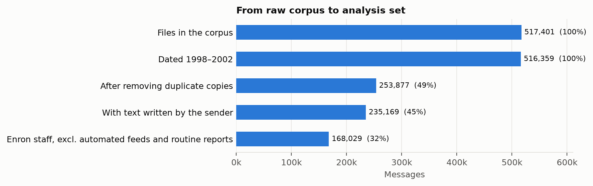
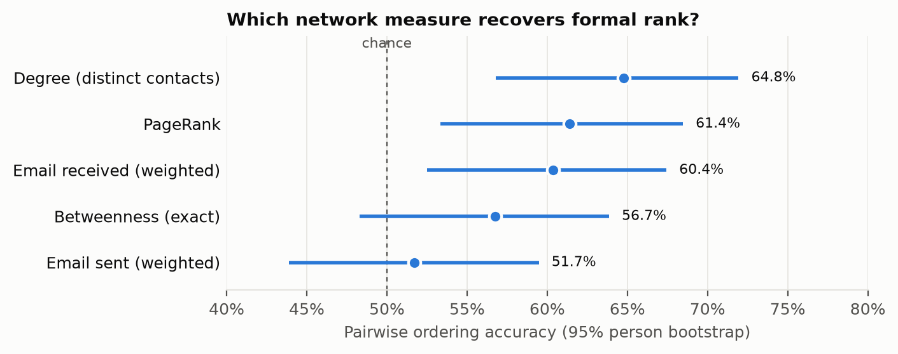

# Hidden Functional Importance in Workplace Email (Enron)

*Can language and communication patterns in email measure how much an
organization depends on a person, and where that differs from their formal rank?*

**Status: rebuild in progress (September 2026).** The first version of this
project (March–May 2026) is preserved in [`legacy/`](legacy/) with a note on why
it is being replaced. This rebuild is fully reproducible: every number and
figure is regenerated from the public corpus by code.

## Research question

Prior NLP work predicts **formal hierarchy** from email (who outranks whom).
This project treats formal rank and **functional importance** (how much others
depend on a person) as separate quantities, measures both from the Enron
corpus, and studies where they diverge. Functional importance is validated
against what happened to a person's contacts after that person left.

## Pipeline

| Stage | Module | Output |
|---|---|---|
| Download and verify corpus (SHA-256) | `download.py` | `data/raw/enron_mail_20150507.tar.gz` |
| Parse every message from the archive | `ingest.py` | `data/interim/messages_raw.parquet` |
| Analysis window and deduplication | `dedupe.py` | deduplicated messages |
| Authored text (quotes, forwards, disclaimers removed) | `clean.py` | `authored` column |
| Automated and system mailbox flags | `senders.py` | sender profiles |

| Reply links, response times, threads | `threads.py` | `reply_to`, `response_seconds`, `thread_id` |
| Addresses resolved to people | `identity.py` | `identities.parquet` |
| Formal rank from the 2004 title list | `formal_rank.py` | `formal_rank.parquet` |
| Person-level network and exact centrality | `network.py` | `edges.parquet`, `centrality.parquet` |
| Pairwise accuracy against formal rank | `evaluate.py` | `results/baselines_formal_rank.csv` |

Later stages (dialog acts, topics, network measures, models, evaluation
figures) are added phase by phase.

## Phase 1 result



| Step | Messages |
|---|---:|
| Files in the corpus | 517,401 |
| Dated 1998–2002 | 516,359 |
| After removing duplicate copies | 253,877 |
| With text written by the sender | 235,169 |
| Enron staff, excluding 312 automated feeds and 11,879 routine report messages | 168,029 (6,349 senders) |

## Phase 2 result: network baselines



Ground truth: seniority levels (CEO 6 … trader/employee 0) for 129 people in
the Shetty & Adibi (2004) title list, matched to corpus identities. Accuracy is
the share of the 6,285 different-level pairs a measure orders correctly (chance
= 50%), with 95% person-level bootstrap intervals. Degree is the strongest
network baseline (64.7%, 56.8–71.9%), consistent with Agarwal et al. (2012),
whose degree baseline reached 79.3% on core-employee pairs of their
reporting-line gold standard. Their gold standard is not currently available
for download; results against it will be added when obtained.

Half of the corpus is duplicate copies of the same message stored in several
folders; the first version of this project counted every copy.

## Reproduce

```sh
uv sync            # exact dependency versions from uv.lock (Python 3.12)
uv run pytest      # unit tests
```

All parameters live in [`config.yaml`](config.yaml). The corpus is the CMU
release of May 7, 2015 (<https://www.cs.cmu.edu/~enron/>), downloaded and
checked against a pinned SHA-256.

## Related work

- Agarwal, Omuya, Harnly & Rambow (2012). A Comprehensive Gold Standard for the Enron Organizational Hierarchy. *ACL*.
- Prabhakaran & Rambow (2014). Predicting Power Relations between Participants in Written Dialog from a Single Thread. *ACL*.
- Gilbert (2012). Phrases That Signal Workplace Hierarchy. *CSCW*.
- Bramsen, Escobar-Molano, Patel & Alonso (2011). Extracting Social Power Relationships from Natural Language. *ACL-HLT*.
- Cohen, Carvalho & Mitchell (2004). Learning to Classify Email into "Speech Acts". *EMNLP*.
- Diesner, Frantz & Carley (2005). Communication Networks from the Enron Email Corpus. *Computational & Mathematical Organization Theory*.

## Author

Jeb Farneth · [jebfarneth.com](https://www.jebfarneth.com)
